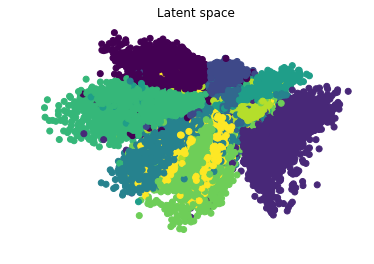
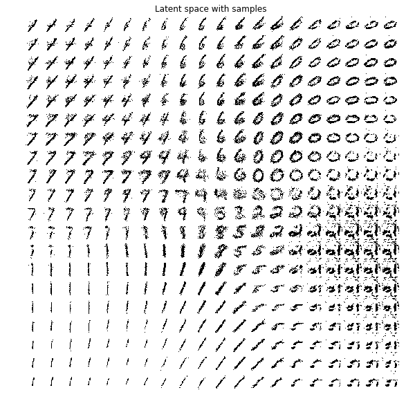
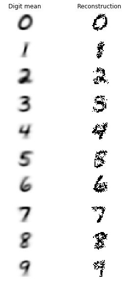

#Variational Autoencoders and Generative Adversarial Networks.

##Variational Autoencoder

Implemented in Tensorflow as defined at https://arxiv.org/pdf/1312.6114.pdf.

The variational autoencoder is a generative and probabilistic model that tries to create encodings that look as though they were
sampled from a normal distribution.

This means that in order to generate a sample from the autoencoder we just need to generate a sample from a standard normal distribution, 
and run it through the decoder.

To construct and train the model we need to define a loss function as usual. However in variational inference we maximize the ELBO

ELBO = E[log p(x|z)] - DKL(q(z|x) || p(z))

The first term refers to maximizing the expected log likelihood. As we need the model to generate probabilities as outputs then we need to pass the logits of the decoder into a sigmoid function. Then, the
expected log likelihood is calculated as follows.

    xentropy = tf.nn.sigmoid_cross_entropy_with_logits(labels=X, logits=logits);
    
The second term refers to The KL Divergence between the normal distribution generated by the latent space and a standard normal distribution (although
the codings are to limited to Gaussian distributions). It acts as a regularizer that forces to cluster, for example, digits with the same value
but with different writings close in the euclidean space.

As tensorflow only provides the minimize function on each of its optimizers, then we have to minimize the -ELBO.

    opt_step = tf.train.AdamOptimizer(learning_rate = self.learning_rate).minimize(-elbo)
    
We can visualize the representations in the latent space of the training set and draw each cluster(digit) in a different 
color.

Another nice visualization is to verify the region in the latent space that will render a certain digit. We
do this by creating a grid in the latent space and reconstructing the digits that correspond to each point in
the grid.

Finally we observe the differences between the mean presentation of each digit with its reconstruction using the
posterior prediction.

 
